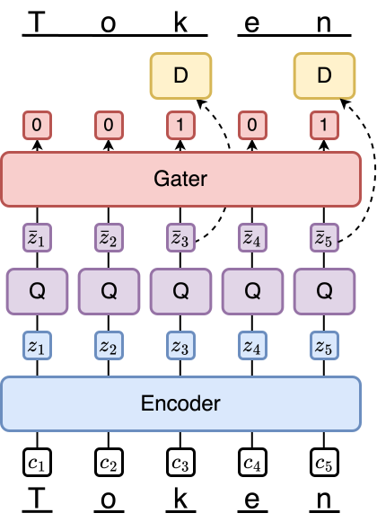
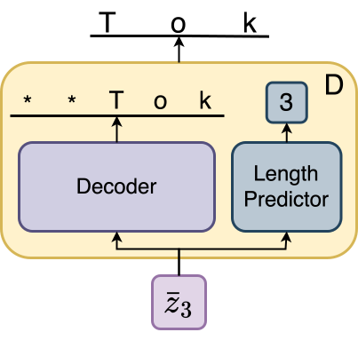

## Abstract

While most frontier models still use deterministic frequency-based tokenization algorithms such as byte-pair encoding (BPE), there has been significant recent work to design learned neural tokenizers. However, these schemes generally add to underlying language model complexity and force large changes to architecture, making them hard to implement at large scales. To overcome these challenges, we propose the gated quantized variational autoencoder (GQ-VAE), a novel architecture that can be independently pre-trained to serve as a drop-in replacement for existing tokenizers. The key innovation of the architecture is to learn to encode variable-length discrete tokens. GQ-VAE improves compression and language modeling performance over a standard VQ-VAE tokenizer, and approaches the compression rate and language modeling performance of BPE. Interestingly, if we use BPE with a smaller vocabulary, such that the compression is equivalent between GQ-VAE and BPE, we find that GQ-VAE improves downstream language model learning. We conclude with a discussion of several exciting avenues for future work.

  
   
  <em>Figure 1: GQ-VAE Architecture. D = Decoder, Q = Quantizer. Encoder and Gater are transformers.</em>
  

  
   
  <em>Figure 2: Decoder head.</em>

## Implementation

Code was run on a single A100 GPU with CUDA 11.8, using the dataset [tinystories](https://huggingface.co/datasets/roneneldan/TinyStories). The functionality is distributed across three main files:

- `/data/data_compiled.py`: Contains code to handle data pre-processing and downloading of data for fast reference at train time. When run after adding a target directory, it is automatically configured to download tinystories in 10 chunks into ASCII with the GPT-2 regex delineating chunks. 
Files: 
- `main.py`: Contains the train loop for the model, with logging and saving information.
- `regex_tokenizer.py`: Wraps a trained checkpoint for the model as a Hugging Face `PreTrainedTokenizer`, allowing encoding/decoding, and also offers speedup options and the ability to guarantee 100% reconstruction accuracy with a fallback system. 

